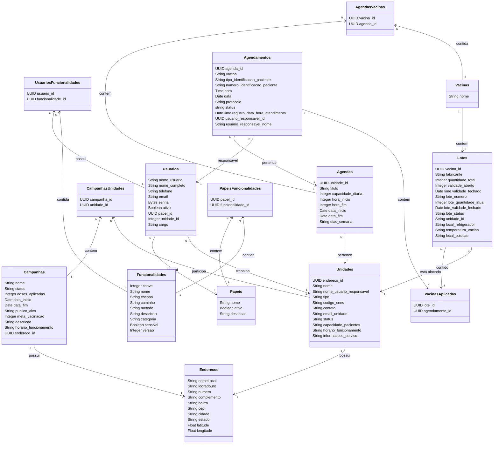

# Documentação do Sistema de Gestão de Vacinação

## Visão Geral do Sistema

Este diagrama de classes representa um sistema completo de gestão de vacinação, abrangendo desde o agendamento de vacinas até o controle de campanhas, lotes e usuários. O sistema permite o gerenciamento de unidades de saúde, agendamentos, aplicação de vacinas e controle de acesso.

## Descrição das Entidades

### 1. **Agendas**
Gerencia os horários e disponibilidades para vacinação nas unidades de saúde.

| Campo | Tipo | Descrição |
|-------|------|-----------|
| `unidade_id` | UUID | Identificador da unidade de saúde |
| `titulo` | String | Título/descrição da agenda |
| `capacidade_diaria` | Integer | Número máximo de atendimentos por dia |
| `hora_inicio` | Integer | Hora de início do atendimento |
| `hora_fim` | Integer | Hora de término do atendimento |
| `data_inicio` | Date | Data de início da vigência da agenda |
| `data_fim` | Date | Data de término da vigência da agenda |
| `dias_semana` | String | Dias da semana em que a agenda está ativa |

### 2. **Agendamentos**
Registra os agendamentos de vacinação dos pacientes.

| Campo | Tipo | Descrição |
|-------|------|-----------|
| `agenda_id` | UUID | Identificador da agenda relacionada |
| `vacina` | String | Tipo de vacina a ser aplicada |
| `tipo_identificacao_paciente` | String | Tipo de documento do paciente |
| `numero_identificacao_paciente` | String | Número do documento do paciente |
| `hora` | Time | Hora do agendamento |
| `data` | Date | Data do agendamento |
| `protocolo` | String | Código único do agendamento |
| `status` | String | Status do agendamento |
| `registro_data_hora_atendimento` | DateTime | Data/hora do atendimento |
| `usuario_responsavel_id` | UUID | Identificador do usuário responsável |
| `usuario_responsavel_nome` | String | Nome do usuário responsável |

### 3. **Unidades**
Representa as unidades de saúde onde as vacinas são aplicadas.

| Campo | Tipo | Descrição |
|-------|------|-----------|
| `endereco_id` | UUID | Identificador do endereço |
| `nome` | String | Nome da unidade |
| `nome_usuario_responsavel` | String | Nome do responsável pela unidade |
| `tipo` | String | Tipo da unidade de saúde |
| `codigo_cnes` | String | Código CNES da unidade |
| `contato` | String | Contato da unidade |
| `email_unidade` | String | E-mail da unidade |
| `status` | String | Status da unidade |
| `capacidade_pacientes` | String | Capacidade de atendimento |
| `horario_funcionamento` | String | Horário de funcionamento |
| `informacoes_servico` | String | Informações adicionais |

### 4. **Enderecos**
Armazena informações de localização das unidades e campanhas.

| Campo | Tipo | Descrição |
|-------|------|-----------|
| `nomeLocal` | String | Nome do local |
| `logradouro` | String | Logradouro do endereço |
| `numero` | String | Número do endereço |
| `complemento` | String | Complemento do endereço |
| `bairro` | String | Bairro |
| `cep` | String | CEP |
| `cidade` | String | Cidade |
| `estado` | String | Estado |
| `latitude` | Float | Coordenada de latitude |
| `longitude` | Float | Coordenada de longitude |

### 5. **Vacinas**
Catálogo de tipos de vacinas disponíveis no sistema.

| Campo | Tipo | Descrição |
|-------|------|-----------|
| `nome` | String | Nome da vacina |

### 6. **Lotes**
Controla o estoque e validade das vacinas.

| Campo | Tipo | Descrição |
|-------|------|-----------|
| `vacina_id` | UUID | Identificador da vacina |
| `fabricante` | String | Fabricante da vacina |
| `quantidade_total` | Integer | Quantidade total do lote |
| `validade_aberto` | Integer | Validade após abertura |
| `validade_fechado` | DateTime | Validade fechado |
| `lote_numero` | String | Número do lote |
| `lote_quantidade_atual` | Integer | Quantidade atual em estoque |
| `lote_validade_fechado` | Date | Data de validade do lote fechado |
| `lote_status` | String | Status do lote |
| `unidade_id` | String | Unidade onde o lote está alocado |
| `local_refrigerador` | String | Localização no refrigerador |
| `temperatura_vacina` | String | Temperatura de conservação |
| `local_posicao` | String | Posição no armazenamento |

### 7. **VacinasAplicadas**
Registra as vacinas efetivamente aplicadas aos pacientes.

| Campo | Tipo | Descrição |
|-------|------|-----------|
| `lote_id` | UUID | Identificador do lote utilizado |
| `agendamento_id` | UUID | Identificador do agendamento relacionado |

### 8. **Campanhas**
Gerencia campanhas de vacinação específicas.

| Campo | Tipo | Descrição |
|-------|------|-----------|
| `nome` | String | Nome da campanha |
| `status` | String | Status da campanha |
| `doses_aplicadas` | Integer | Número de doses aplicadas |
| `data_inicio` | Date | Data de início da campanha |
| `data_fim` | Date | Data de término da campanha |
| `publico_alvo` | String | Público-alvo da campanha |
| `meta_vacinacao` | Integer | Meta de vacinação |
| `descricao` | String | Descrição da campanha |
| `horario_funcionamento` | String | Horário de funcionamento |
| `endereco_id` | UUID | Identificador do endereço |

### 9. **Usuarios**
Gerencia os usuários do sistema e suas permissões.

| Campo | Tipo | Descrição |
|-------|------|-----------|
| `nome_usuario` | String | Nome de usuário para login |
| `nome_completo` | String | Nome completo do usuário |
| `telefone` | String | Telefone de contato |
| `email` | String | E-mail do usuário |
| `senha` | Bytes | Senha criptografada |
| `ativo` | Boolean | Status do usuário |
| `papel_id` | UUID | Identificador do papel/perfil |
| `unidade_id` | Integer | Identificador da unidade de lotação |
| `cargo` | String | Cargo/função do usuário |

### 10. **Papeis**
Define os perfis de acesso ao sistema.

| Campo | Tipo | Descrição |
|-------|------|-----------|
| `nome` | String | Nome do papel |
| `ativo` | Boolean | Status do papel |
| `descricao` | String | Descrição do papel |

### 11. **Funcionalidades**
Catálogo de funcionalidades do sistema.

| Campo | Tipo | Descrição |
|-------|------|-----------|
| `chave` | Integer | Chave única da funcionalidade |
| `nome` | String | Nome da funcionalidade |
| `escopo` | String | Escopo de aplicação |
| `caminho` | String | Caminho/URL da funcionalidade |
| `metodo` | String | Método HTTP |
| `descricao` | String | Descrição da funcionalidade |
| `categoria` | String | Categoria da funcionalidade |
| `sensivel` | Boolean | Indica se é sensível |
| `versao` | Integer | Versão da funcionalidade |

## Relacionamentos Principais

### Gestão de Agendamentos
- **Unidades → Agendas**: Cada unidade possui múltiplas agendas
- **Agendas → Agendamentos**: Cada agenda contém múltiplos agendamentos
- **Agendamentos → VacinasAplicadas**: Cada agendamento pode resultar em vacinas aplicadas

### Controle de Estoque
- **Vacinas → Lotes**: Cada vacina pode ter múltiplos lotes
- **Lotes → VacinasAplicadas**: Os lotes são utilizados nas aplicações
- **Lotes → Unidades**: Os lotes estão alocados em unidades específicas

### Gestão de Campanhas
- **Campanhas → CampanhasUnidades**: Cada campanha pode envolver múltiplas unidades
- **Unidades → CampanhasUnidades**: Cada unidade pode participar de múltiplas campanhas

### Controle de Acesso
- **Usuarios → Papeis**: Cada usuário possui um papel/perfil
- **Papeis → PapeisFuncionalidades**: Cada papel tem permissões para funcionalidades
- **Usuarios → UsuariosFuncionalidades**: Usuários podem ter permissões específicas

## Funcionalidades do Sistema

1. **Agendamento de Vacinas**: Sistema completo de agendamento com controle de capacidade
2. **Gestão de Unidades**: Cadastro e gestão de unidades de saúde
3. **Controle de Estoque**: Gestão de lotes e validade de vacinas
4. **Campanhas de Vacinação**: Organização e monitoramento de campanhas
5. **Controle de Acesso**: Sistema de permissões baseado em papéis
6. **Relatórios e Métricas**: Acompanhamento de doses aplicadas e metas

Este sistema oferece uma solução completa para a gestão de processos de vacinação, desde o agendamento até a aplicação e controle de estoque.